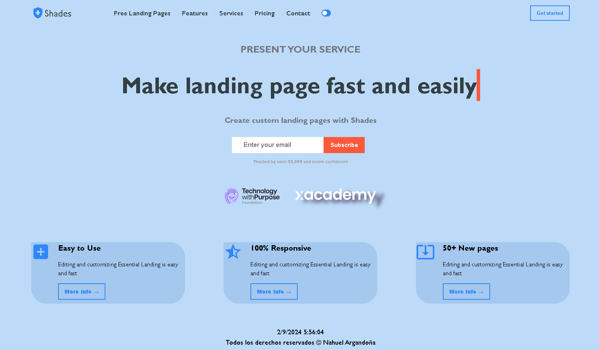

Landing Page XAcademyProject
Descripción
Este proyecto es una landing page moderna diseñada para presentar servicios, destacar características y facilitar la suscripción por correo electrónico. La página está desarrollada utilizando Angular para el frontend y sigue buenas prácticas de desarrollo web, incluyendo la optimización del rendimiento y la accesibilidad.

Web Online in netlify.app: https://sweet-semifreddo-c4a0aa.netlify.app/
<figure></figure>

Características
Modo Oscuro/Claro: Alterna entre modo oscuro y claro con un interruptor de palanca.
Menú de Navegación: Menú de navegación responsivo que se ajusta para pantallas móviles y de escritorio.
Suscripción por Correo Electrónico: Formulario para suscribirse a actualizaciones.
Optimización de Rendimiento: Código optimizado para un rendimiento fluido y rápida respuesta de la interfaz.
 
Tecnologías Utilizadas
Angular: Framework para construir la interfaz de usuario.
CSS/SCSS: Para el estilo y diseño de la página.
Material Icons: Para íconos de la interfaz.
Google Fonts: Fuentes utilizadas para mejorar la apariencia del texto.
 
Estructura del Proyecto
La estructura del proyecto incluye los siguientes componentes:

header.component.html: Contiene el encabezado de la página con el logo, el menú de navegación y los botones.
main.component.html: La sección principal que presenta el servicio, las características y los elementos visuales.
footer.component.html: El pie de página con la información de derechos reservados y la fecha y hora actual.
app.component.html: Contiene los componentes Header, Main, y Footer dentro de un contenedor principal.
theme.service.ts: Servicio para manejar el modo oscuro/claro y el almacenamiento en localStorage.
header.component.ts: Lógica para inicializar el modo y manejar el menú hamburguesa.
main.component.ts: Inicializa el modo de tema al cargar.
footer.component.ts: Actualiza la fecha y hora y aplica el tema.
 
Configuración
Para configurar y ejecutar el proyecto localmente, sigue estos pasos:

This project was generated with Angular CLI version 18.1.0.

Clona el Repositorio

bash
Copiar código
git clone <https://github.com/Aubar48/xAcademyProyect>
Instala las Dependencias

bash
Copiar código
cd <xAcademyProyect>
npm install
Ejecuta el Proyecto

bash
Copiar código
ng serve
Accede a la Aplicación Abre tu navegador y ve a http://localhost:4200.

 
Uso
Cambiar Modo: Utiliza el interruptor en el encabezado para alternar entre modo oscuro y claro.
Navegación: Usa el menú de navegación para explorar las secciones de la página.
Suscripción: Ingresa tu correo electrónico en el formulario de suscripción para recibir actualizaciones.
